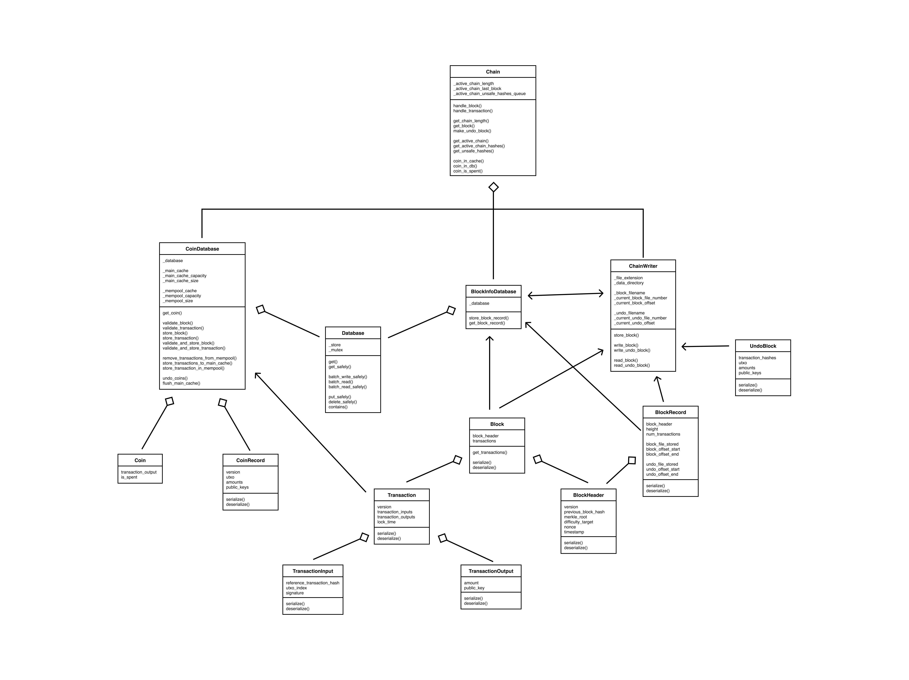

# Description

RathDB is a blockchain storage solution for a cryptocurrency that follows from Bitcoin's own solution. It is written in C++ with libraries and executables compiled using CMake.

I created this project for Brown University's Blockchain & Cryptocurrencies course along with one of the course's HTAs (Head Teaching Assitant). Since this project was developed for Brown University, I am NOT able to share our implementation of the project. However, I am able to share this stencil that we provided to the students.

# Class Structure

RathDB has several interacting classes, as shown by the UML class diagram I've created below:

Here are some brief (alphabetized) explanations for RathDB's main classes. For more in-depth explanations, check out our documentation in the `/core/include/` directories. For example, you will find documentation for the BlockInfoDatabase class in `/core/include/block_info_database/documentation` directory. Note: not all classes have documentation.

- Block: the Chain's way of recording information on Transactions. It is composed of a BlockHeader and a list of Transactions.

- BlockHeader: metadata concerning a Block. Its most important fields are the previous Block's hash, a merkle root for the Block's Transactions, and the Nonce (number only used once).

- BlockInfoDatabase: a wrapper for a key-value store that stores Block information (typically on DISK). Its keys are Block hashes and its values are BlockRecords.

- BlockRecord: contains information about where Blocks and their corresponding UndoBlocks are stored on DISK.

- Chain: the top-level object for this project, the Chain acts as an interface between a Node (if this project were a fully-fledges cryptocurrency) and storage. As a result, it is mainly an API that handles querying and storing Blocks and Transactions. The chain is composed of 3 main components: a CoinDatabase, a ChainWriter, and a BlockInfoDatabase.

- ChainWriter: an interface to access the blocks that are stored on DISK. It gives the ability to write Blocks and UndoBlocks to DISK as well as read them from DISK.

- Coin: a wrapper for a TransactionOutput that includes whether or not that TransactionOutput has previously been spent on the Blockchain.

- CoinDatabase: keeps track of whether TransactionOutputs (UTXO) are valid. It contains 2 main components: a Main Cache and a Database. The Main Cache is a key-value store of Transaction hashes (key) mapped to Coins (value). The Database is a key-value store of Transaction hashes (key) mapped to CoinRecords (value). Notice that both the Main Cache and the Database have the same key. This is because the CoinDatabse first queries the fast on-RAM Main Cache to see if a Coin exists, then queries the slow on-DISK Database.

- CoinRecord: a record of which TransactionOutputs have been spent on a certain Transaction.

- Database: our implementation of a key-value store. For reference, Bitcoin uses leveldb, a string-based key-value store created by Google with multiple layers of caching.

- Transaction: a record of a transfer of a cryptocurrency from one party to another. It is composed of TransactionInputs and TransactionOutputs.

- TransactionInput: essentially a pointer to a TransactionOutput, which is used in order to send units of the cryptocurrency to a receiver.

- TransactionOutput: an abstraction of digital currency. A TransactionOuput has an amount and a public key, which designates the owner of that amount. Unspent TransactionOutputs are commonly refered to as UTXO. The sum of all TransactionOutputs' amounts is the money supply of the cryptocurrency.

- UndoBlock: information for how to "undo" a Block added to the Chain, as is the case when a fork occurs. The UndoBlock stores information about Transactions and is structured very similarly to the CoinRecord.

# Example Functionality

## Chain receives a valid Block

When the chain receives a Block, it must firt validate that Block and see if it can be added to its main chain. To do this, it queries the CoinDatabase, which keeps track of unspent Coins. Any Transaction that uses an already spent Coin or uses a Coin that doesn't exist invalidates the whole Block. The CoinDatabase stores as many Coins as possible in its Main Cache to optimize this process.

Let's assume that the Block validates, which means that every Transaction it contains validates (along with some other sanity checks). The CoinDatabase marks all of those unspent Coins as spent and adds the newly created TransactionOutputs to its Main Cache as Coins. It informs the Chain that the Block did in fact validate.

The Chain must now store the Block. First, its own fields: length, last block,and unsafe hashes. Then, the Chain delegates to the ChainWriter to write both a Block and an UndoBlock to DISK. The Chain stores these Blocks on DISK because they are no longer useful once their TransactionOuputs have been added to the CoinDatabase. The ChainWriter returns information on where they are stored, which the Chain synthesizes as a BlockRecord. The BlockRecord's sole purpose is to keep track of where Blocks and UndoBlocks are located.

The Chain then delegates to the BlockInfoDatabase to store this BlockRecord. This comes in handy in the case of a fork (see below).

The Chain is now up-to-date.

## Chain forks

Blockchains are optimized under the assumption that forks are rare, so handling a fork is a somewhat convoluted process. A fork occurs when a Chain receives a Block that is a part of a longer blockchain than the Chain's own main chain.

Let's say that the Chain's current main chain has a length of 50. The Chain handles a Block whose previous Block had a height of 51 (and thus has a heigth of 52. A Block added to the current main chain would require a height of 51). Our Chain is now aware of a longer chain, and therefore must fork.

To fork, the Chain first finds a common ancestor with this new chain. Once it has a found that common ancestor, it queries the BlockInfoDatabase for UndoBlocks. This is because the Chain must now revert back to that common ancestor. The Chain passes these UndoBlocks to the CoinDatabase, which allows it to delete newly invalid Coins and revert its CoinRecords to a state where the Block in question never existed.

Once it has "undone" all of the relevant Blocks, the Chain now queries the BlockInfoDatabase for the Blocks that it must now add to get up-to-date.
It does this by handling them sequentially as valid blocks, following the same process as described above in "Chain receives a valid Block."

Note: In the real world, it is unlikely that a Chain would have the requisite Blocks to get up-to-date. A node would have to query other nodes in order to get the Blocks that it's missing. RathDB simplifies this process quite a bit, as node functionality is absent.

The Chain is now up-to-date.
